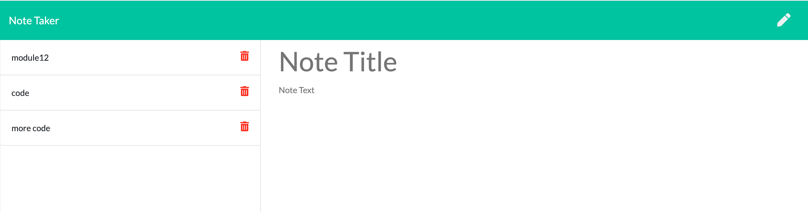

# Note-Taker-Application

## Images :camera_flash:

The following image shows the web application's appearance and functionality: 

## Description :heavy_plus_sign: 

This code feature an application called Note Taker that can be used to write and save notes. It uses an Express.js back end and saves and retrieves note data from a JSON file.

With provided front end, the application features building of the back end, connecting the two, and deployment of the entire application to Heroku.

## Technology Used :label: 

* CSS
* HTML
* Node.js
* Express 

## Resources Used :wrench: 

* https://nodejs.org/api/util.html
* https://www.npmjs.com/package/uuid
* https://www.npmjs.com/package/uniqid
* https://github.com/ikatyang/emoji-cheat-sheet

## Installation :electric_plug:

* to install dependencies, run the following commands: npm i express, npm i uniqid

 ### Questions :question: 
  Feel free to contact me with any questions via email :e-mail: pryadkamaryna@gmail.com. 
  
  If you'd like to see my other projects, please checkout my :octocat: [GitHub]
 (https://github.com/MarynaPR?tab=repositories)

